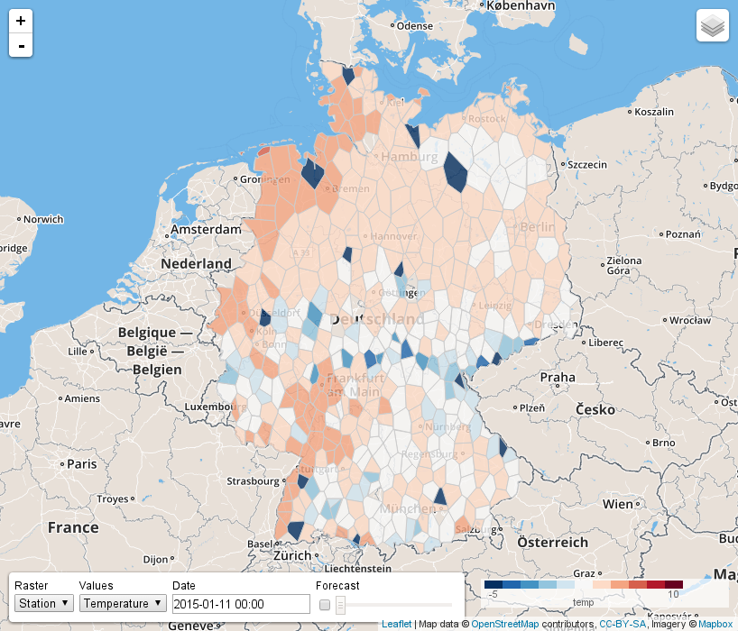

# Introduction
- Topic
- Motivation
- Aims

# Data Sources
- kurze Beschreibung der drei Datenquellen
- vielleicht die (konzeptuelle) Beschreibung der Download Prozesse auch hier?

# Data Model

- ER Modell plus 2-3 Sätze

# Architecture
- Bild + Beschreibung

# Optimizations
- Indices
- Contrib Tables
- Topology Simplification

# Usage

As mentioned in the Architecure section, the weather map is displayed with HTML5 and 
controlled with JavaScript. It has been developed as a control for the Leaflet 
library and tested on Google Chrome and Chromium. Other browsers are not offically 
supported.

By default Leaflet is using a zoom and a layer selection control. Instead of
rendering the basetiles ourselves, we are using the freely available 
[OSM Tile Server](http://wiki.openstreetmap.org/wiki/Tile_usage_policy)
and tiles generated for free by [Mapbox](https://www.mapbox.com/). 
The desired basetile layer can be selected as seen in fig. ?? 

The map can also be panned and zoommed by using a pointing device (e.g. mouse).

The displayed weather data can be set by an additional control as seen in fig. ?? 

It allows to choose either temperatures or reciproc.?? rainfall for a certain day. 
The day can be selected with an interactive datetime picker as seen in fig. ??

The selected date and time is also used to pick the computed GFS 
used to display forecasts. If the forecast box is checked, the forecasts slider is activated
and allows to select point of forecast in hours, starting from the chosen 
date and time.

As mentioned before, the data can be displayed for different rasters: a voronoi tesselation 
based on offical weather stations, german states or districts. The desired raster
can be selected with the control.
Once the selection did change, the weather control is loading the matching data
from the backend via a JSON interface and displays the raster on the map. 

The cells are colored according to selected data and a legend is shown on the lower 
right for reference (see fig. ?? - ??)

Each cell is clickable and highlights it's border or, in case of the voronoi tesselation,
the position of the weather station. Furthermore a popup is shown, which is showing
additional data associated to the selected cell by calling the backends JSON interface.

Currently this is just the alphanumerical attributes, but could be used to show 
automatically generated temperature timelines or recent webcam photos or ... [__TODO: noch mehr ausblick kram...__]

- kurze Beschreibung was wir Anzeigen können
- Screenshots (da sind sie glaub ich geil drauf)

# Conclusion
- lessons learned

# Appendix
- Literature (if any)
- Setup Guide
- Link to Repo
